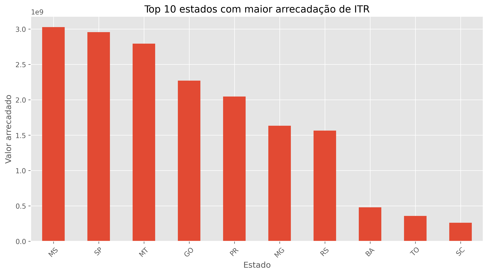

# 📊 Análise Exploratória da Arrecadação do ITR no Brasil



Projeto desenvolvido durante a **Pós-Graduação em Engenharia de Dados**, com o objetivo de realizar o tratamento, a análise exploratória e a visualização dos dados públicos de arrecadação do **Imposto sobre a Propriedade Territorial Rural (ITR)**.

Ao longo do projeto foram aplicadas técnicas de ingestão, limpeza, transformação, avaliação da qualidade dos dados e análise exploratória utilizando Python.

---

## 🎯 Objetivos

Este projeto busca responder às seguintes perguntas:

- Quais estados apresentam maior arrecadação do ITR?
- Como a arrecadação evoluiu ao longo dos anos?
- Existe concentração regional da arrecadação?
- Quais municípios concentram os maiores valores arrecadados?
- Existem inconsistências ou valores ausentes na base de dados?

---

## 🛠️ Tecnologias utilizadas

- Python 3.10+
- Pandas
- NumPy
- Matplotlib
- Jupyter Notebook

---

## 📂 Estrutura do projeto

```text
analise-arrecadacao-itr/
│
├── data/
│   ├── raw/
│   └── processed/
│
├── images/
│
├── notebook/
│   └── analise_arrecadacao_itr.ipynb
│
├── relatorio/
│   └── Relatorio_Academico_ITR.pdf
│
├── README.md
└── requirements.txt
```

---

## 🔄 Etapas da análise

O projeto contempla as seguintes etapas:

- Ingestão dos dados;
- Tratamento e padronização das informações;
- Correção de inconsistências;
- Conversão dos tipos de dados;
- Avaliação da qualidade dos dados;
- Tratamento dos valores ausentes;
- Análise exploratória;
- Visualização dos resultados;
- Interpretação dos principais insights.

---

## 📈 Principais resultados

Durante a análise foi possível identificar:

- concentração da arrecadação em determinados estados;
- predominância da região Centro-Oeste nos valores arrecadados;
- crescimento da arrecadação ao longo do período analisado;
- concentração dos maiores valores em poucos municípios;
- baixa ocorrência de valores ausentes na base de dados.

---

## ▶️ Como executar

Clone o repositório:

```bash
git clone https://github.com/SEU-USUARIO/analise-arrecadacao-itr.git
```

Acesse a pasta do projeto:

```bash
cd analise-arrecadacao-itr
```

Instale as dependências:

```bash
pip install -r requirements.txt
```

Abra o Jupyter Notebook e execute:

```text
notebook/analise_arrecadacao_itr.ipynb
```

---

## 📊 Dataset

Os dados utilizados são públicos e foram obtidos no Portal Brasileiro de Dados Abertos.

**Conjunto de dados:**

Resultado da Arrecadação

https://dados.gov.br/dados/conjuntos-dados/resultado-da-arrecadacao

**Recurso utilizado:**

Arrecadação de ITR detalhada.

---

## 📑 Relatório

O repositório também disponibiliza o relatório acadêmico desenvolvido durante a disciplina **Python para Engenharia de Dados**.

O documento apresenta uma síntese da metodologia aplicada, dos tratamentos realizados e dos principais resultados obtidos durante a análise.

Arquivo disponível em:

```text
relatorio/Relatorio_Academico_ITR.pdf
```

---

## ⚠️ Premissas adotadas

Durante a preparação dos dados foram identificados poucos registros com valores ausentes.

Para possibilitar as análises estatísticas e operações de agregação, esses registros foram convertidos para **0**. Essa decisão foi adotada considerando o contexto do ITR, no qual existem situações previstas em lei em que não há arrecadação, além da baixa representatividade desses registros na base de dados.

Como a base pública utilizada não disponibiliza documentação descrevendo o significado dos valores ausentes, essa conversão foi tratada como uma premissa metodológica do projeto.

---

## 🚀 Possíveis evoluções

- Desenvolvimento de dashboard interativo com Streamlit;
- Exportação dos dados tratados para Parquet;
- Automatização do pipeline de tratamento de dados;
- Integração com Power BI;
- Inclusão de testes de qualidade dos dados.

---

## 👩‍💻 Autora

**Brenda Drewanz Camargo**

Projeto desenvolvido durante a Pós-Graduação em Engenharia de Dados.